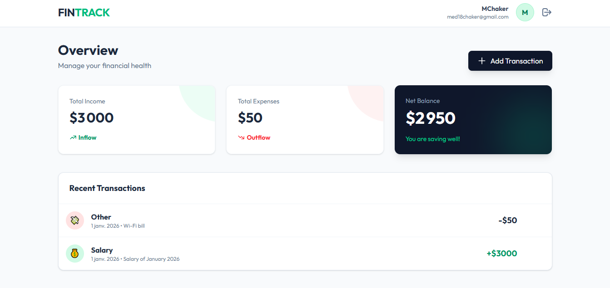
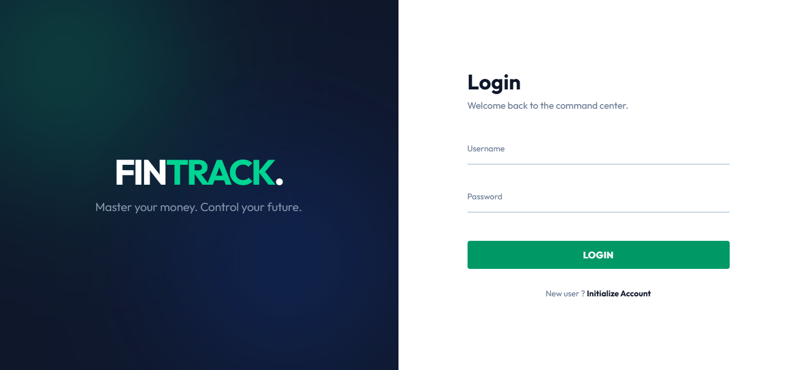
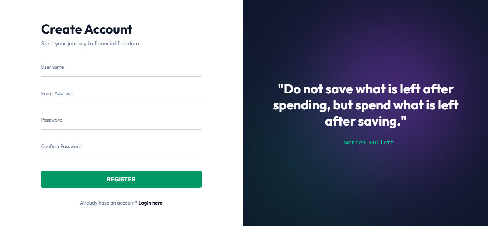

# Personal Finance Tracker (MERN)

A professional full-stack financial management application that allows users to track income and expenses, visualize their total balance in real-time, and manage transactions through a secure, authenticated interface.

## 📸 Screenshots

  
<strong>Dashboard View</strong>

  
   
  
<strong>Authentication Flow</strong>

  
  

## 🚀 Key Engineering Features

### 1. Global State & Derived Logic
Instead of manually updating the total balance state (which is prone to bugs), this project utilizes **Derived State**. Using the `useMemo` hook, the application automatically recalculates total Income, Expenses, and Balance whenever the transaction list changes. This ensures data integrity and prevents "State Synchronization Hell."

### 2. Stable API Communication
To prevent unnecessary re-renders and infinite loops, all primary API functions (like `fetchTransactions`) are wrapped in the `useCallback` hook. This ensures that the function reference remains stable across renders, allowing it to be safely used in `useEffect` dependency arrays.

### 3. Professional Axios Interceptors
Implemented a robust API utility using Axios Interceptors:
- **Request Interceptor:** Automatically attaches the JWT token to every outgoing request.
- **Response Interceptor:** Gracefully handles `401 Unauthorized` errors by clearing local storage and redirecting the user to the login page if their session expires.

### 4. Controlled Modal UX
The Transaction Form is built as a Modal using a "Lifting State Up" pattern. It utilizes **Event Propagation Control** (`e.stopPropagation()`) to ensure that clicks inside the form don't accidentally close the modal, providing a smooth and predictable user experience.

## 🛠 Tech Stack
- **Frontend:** React 19 (Context API, Hooks), Tailwind CSS, Axios
- **Backend:** Node.js, Express.js, MongoDB (Mongoose)
- **Auth:** JSON Web Tokens (JWT), Bcrypt.js
- **Build Tool:** Vite

## ⚙️ Installation & Setup

1. **Clone the repository**
2. **Setup Backend:**
   - Navigate to `/backend`
   - Create a `.env` file with `PORT`, `DB_URI`, and `JWT_SECRET`
   - Run `npm install` then `npm run dev`
3. **Setup Frontend:**
   - Navigate to `/frontend`
   - Create a `.env` file with `VITE_API_URL`
   - Run `npm install` then `npm run dev`

## 🧠 Lessons Learned
- Mastering the difference between **Local State** and **Global Context**.
- How to handle **Asynchronous state updates** when adding/deleting items from an array.
- The importance of **Defensive Programming** (using fallbacks like `|| []`) to prevent UI crashes when API data is missing or ill-formatted.
